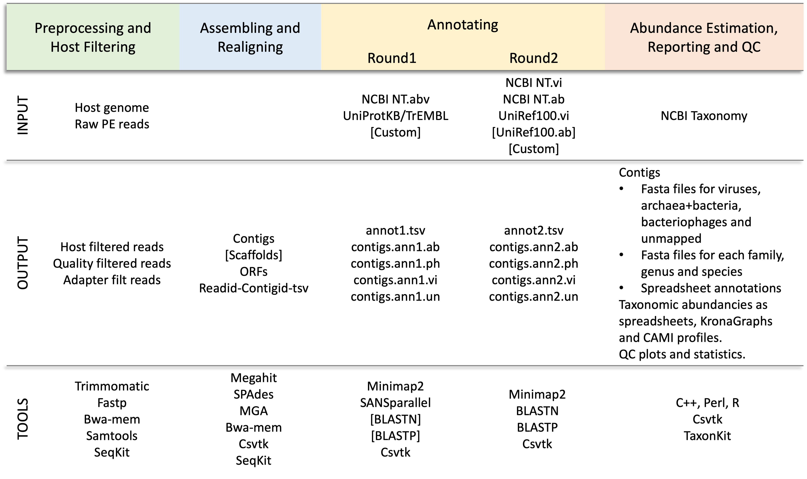
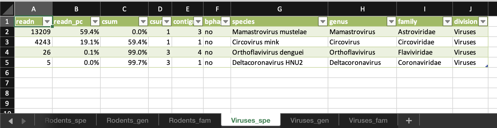
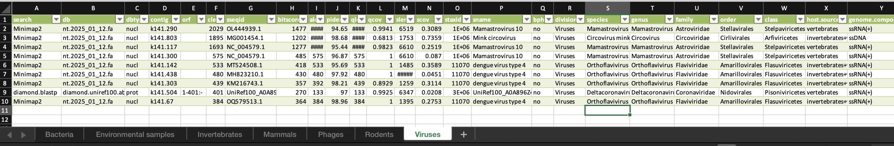
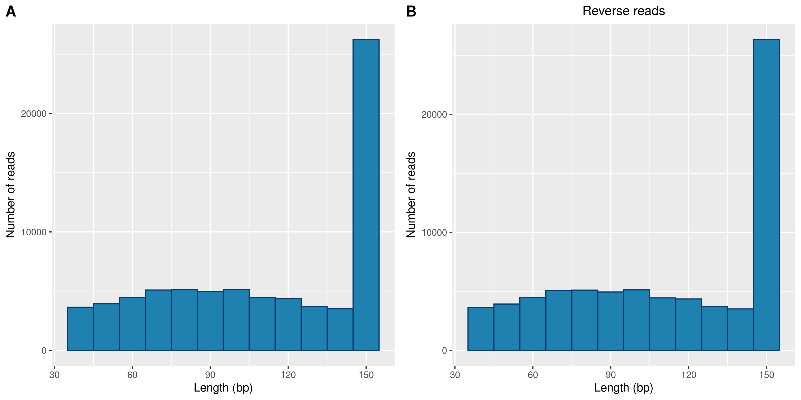
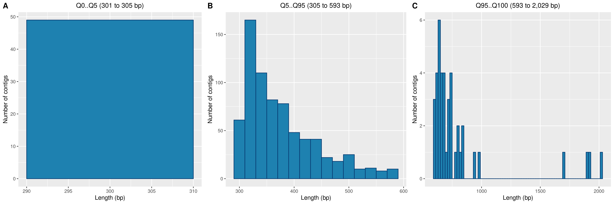

## Lazypipe User Guide
### Running Lazypipe v3.1 on a Linux cluster

### Table of Content
1. [About Lazypipe](#About)
2. [Running on CSC](#RunningLazypipeOnCSC)
3. [Installing](#InstallingLazypipe)
    * [Setting up directories](#SettingUpDirectories)
    * [Cloning repository](#CloningRepository)
    * [Installing dependencies](#InstallingDependencies)
        * [Installing with Conda](#InstallingDependenciesConda)
        * [Installing manually](#InstallingDependenciesManually)
    * [Installing Perl modules](#InstallingPerlModules)
    * [Installing R libraries](#InstallingRLibraries)
    * [Installing reference databases](#InstallingReferenceDatabases)
4. [Running Lazypipe](#RunningLazypipe)
	 * [Annotation Strategies](#AnnotationStrategies)
    * [Example 1: analyzing sample data](#Example1)
    * [Example 1: generated reports](#Example1Reports)
        * [abundance tables](#AbundanceTables)
        * [annotation tables](#AnnotationTables)
        * [Krona graph](#KronaGraph)
        * [Quality control plots](#QualityControlPlots)
	* [Retrieving reads for a contig or taxid](#RetrievingReads)
    
5. [command-line options](#CommandLineOptions)
6. [config.yaml options](#ConfigOptions)
7. [Citing Lazypipe](#Citing)
8. [Contact](#Contact)

### About Lazypipe 

Lazypipe is a bioinformatic pipeline for analyzing virus and bacteria metagenomics from NGS data.

**Figure 1.** *Lazypipe workflow*

**Lazypipe supports:**

* fastq preprocessing
* host/background filtering
* de novo assembling
* taxonomic binning
* taxonomic profiling
* reporting
	* contig annotations (tsv and excel)
	* taxon abundancies (tsv, excel and KronaGraph)
	* fasta files for
		* viral contigs
		* bacterial/archaeal contigs
		* bacteriophage contigs
		* each mapped order, family and genus
		* unmapped contigs
	* reads for contigs and mapped taxa
   * quality control plots
   * Integrative Genome Viewer reports for visualing placement of contigs relative to reference genomes

### Running Lazypipe on CSC

Lazypipe can be quickly assessed using a [preinstalled module](https://docs.csc.fi/apps/lazypipe/) at the [Finnish Center of Scientific Computing](https://research.csc.fi/).

## Installing Lazypipe

### Setting up directories

Create directories for storing reference databases, host/background filters, taxonomy and pipeline results (change `/my/data/path` according to your preferences):

    lazypipe_data=/my/data/path
    mydata=/my/data/path
    mkdir -p $lazypipe_data/databases $lazypipe_data/hostgenomes $lazypipe_data/taxonomy 
    mkdir -p $mydata/results

Add environment variables that are used in the default `config.yaml`: `$databases`, `$hostgenomes`, `$taxonomy` and `$mydata`. To add environmen variables locate *.bashrc* file in your home directory and add these lines:

    export databases=/my/data/path/databases
    export hostgenomes=/my/data/path/hostgenomes
    export taxonomy=/my/data/path/taxonomy
    export mydata=/my/data/path

### Cloning the repository ###

    git clone https://plyusnin@bitbucket.org/plyusnin/lazypipe.git
    cd lazypipe

### Installing dependencies ###

#### Installing dependencies with Conda

    
We recommend installing *BLAST* under a separate *Conda* environment labeled `blast`:

    conda create -n blast -c bioconda blast

All other dependencies can be installed under environment labeled `Lazypipe`:
    
    conda create -n lazypipe -c bioconda -c eclarke bwa csvtk fastp krona megahit mga minimap2 samtools seqkit spades taxonkit trimmomatic numpy scipy requests
    
*Mac users*  installing to *M1/M2 ARM64 architecture*: Prior to installing bio-packages configure *Conda* with `conda config --add subdirs osx-64`. You may also need to install `MGA` binary manually (see Table 1).

To activate all installed dependencies type:

    conda activate blast
    conda activate --stack lazypipe
    
Set taxonomy database location for KronaGraph:

     rm -rf $CONDA_PREFIX/conda/env/lazypipe/opt/krona/taxonomy
     ln -s $data/taxonomy $CONDA_PREFIX/conda/env/lazypipe/opt/krona/taxonomy
     
Set env variable *$TM* to point to trimmomatic directory:

     export TM=$CONDA_PREFIX/share/trimmomatic
    
Download PANNZER (version 02/2022 or later) and set *runsanspanz.py* as executable to your path:

    wget http://ekhidna2.biocenter.helsinki.fi/sanspanz/SANSPANZ.3.tar.gz
    tar -zxvf SANSPANZ.3.tar.gz
    echo '#!'$(which python) 1> SANSPANZ.3/runsanspanz.ex.py
    cat SANSPANZ.3/runsanspanz.py >> SANSPANZ.3/runsanspanz.ex.py
    chmod 755 SANSPANZ.3/runsanspanz.ex.py
    ln -sf $(pwd)/SANSPANZ.3/runsanspanz.ex.py ~/bin/runsanspanz.py

#### Installing dependencies manually

Download and unpack dependencies listed in Table 1. 
Then copy or link these executables to your ~/bin folder. For example:

    wget https://github.com/lh3/minimap2/releases/download/v2.24/minimap2-2.24_x64-linux.tar.bz2
    tar -xjvf minimap2-2.24_x64-linux.tar.bz2
    cp minimap2-2.24_x64-linux/minimap2 ~/bin/
	

| Tool           |  Website         | Download binaries        | Original article                  
| :------------- | :----------------| :------------------------|:-------------------|
|  blast        | https://blast.ncbi.nlm.nih.gov/ | [blast+/LATEST/](https://ftp.ncbi.nlm.nih.gov/blast/executables/blast+/LATEST/) | https://doi.org/10.1186/1471-2105-10-421
| bwa-mem        | https://github.com/lh3/bwa     | [bio-bwa/files](https://sourceforge.net/projects/bio-bwa/files/)                | https://arxiv.org/abs/1303.3997
| csvtk          | https://bioinf.shenwei.me/csvtk/  | [csvtk/releases](https://github.com/shenwei356/csvtk/releases/)  |              
| diamond        | https://github.com/bbuchfink/diamond | [diamond/releases](https://github.com/bbuchfink/diamond/releases/) | https://doi.org/10.1038/s41592-021-01101-x
| fastp          | https://github.com/OpenGene/fastp | http://opengene.org/fastp/fastp    | https://doi.org/10.1093/bioinformatics/bty560
| KronaTools     | https://github.com/marbl/Krona/wiki/KronaTools  | NA     | https://doi.org/10.1186/1471-2105-12-385
| MEGAHIT        | https://github.com/voutcn/megahit/              | [megahit/releases](https://github.com/voutcn/megahit/releases) | https://doi.org/10.1016/j.ymeth.2016.02.020
| MGA            | http://metagene.nig.ac.jp/metagene/ | http://metagene.nig.ac.jp/metagene/download_mga.html | https://doi.org/10.1093/nar/gkl723 
| minimap2       | https://github.com/lh3/minimap2     | [minimap2/releases](https://github.com/lh3/minimap2/releases) | https://doi.org/10.1093/bioinformatics/bty191 
| PANNZER/SANS   | http://ekhidna2.biocenter.helsinki.fi/sanspanz/ | [SANSPANZ.3.tar.gz](http://ekhidna2.biocenter.helsinki.fi/sanspanz/SANSPANZ.3.tar.gz)                | https://doi.org/10.1002/pro.4193 
| TaxonKit       | https://bioinf.shenwei.me/taxonkit/   | [taxonkit/releases](https://github.com/shenwei356/taxonkit/releases) | https://doi.org/10.1016/j.jgg.2021.03.006 
| [Trimmomatic]  | https://github.com/usadellab/Trimmomatic  | [v0.39.tar.gz](https://github.com/usadellab/Trimmomatic/archive/refs/tags/v0.39.tar.gz) | https://doi.org/10.1093/bioinformatics/btu170
| Samtools       | http://www.htslib.org/          | [samtools/releases](https://github.com/samtools/samtools/releases/) | https://doi.org/10.1093/gigascience/giab008  
| SeqKit         | https://bioinf.shenwei.me/seqkit/   | [seqkit/releases](https://github.com/shenwei356/seqkit/releases/) | https://doi.org/10.1371/journal.pone.0163962  
| [SPAdes]       | https://github.com/ablab/spades   | [SPAdes/releases](https://github.com/ablab/spades/releases) | https://doi.org/10.1002/cpbi.102  

**Table 1**: Lazypipe dependencies.
Tools in square brackets are not required for basic Lazypipe runs. When installed, these will provide additional functionalities.
	

#### Installing Perl modules

Install modules to any path you have permissions to.
For example, to install under your \$HOME directory start by configuring *cpan*:

    cpan
    cpan> o conf makepl_arg INSTALL_BASE=$HOME/perl5
    cpan> o conf commit
    cpan> exit
    
Then install the modules:

    cpan File::Basename File::Temp Getopt::Long MIME::Base64 YAML::Tiny Sort::Naturally 
    
Open configuration file for terminal sessions (e.g. `$HOME/.bash_profile`, `$HOME/.bashrc`) and add your local Perl library to $PERL5LIB:

    export PERL5LIB=$HOME/perl5/lib/perl5:{$PERL5LIB}

#### Installing R libraries
   
Open R console and type

    install.packages( c("reshape","openxlsx", "ggplot2","cowplot") );

#### Installing Lazypipe databases

Install *NCBI Taxonomy* using the following call. This will install to the default path set in `$taxonomy` environment variable.

    perl perl/install_db.pl --db taxonomy -v

Install reference databases. 

For default *virus discovery* and *virus annotation* pipelines we recommend installing databases listed in *Table 2*.

For fast annotation of viral sequences (although with a higher rate of false positives) install virus-only databases listed in *Table 3*.

For RefSeq-based annotations install databases listed in *Table 4*.

For example, use the following calls to install default databases. This will install to the default path set in `$databases` environment variable.

    perl perl/install_db.pl --db minimap.nt.abv -v
    perl perl/install_db.pl --db minimap.nt.vi -v
    perl perl/install_db.pl --db blastn.nt.abv -v
    perl perl/install_db.pl --db blastn.nt.vi -v
    perl perl/install_db.pl --db blastp.uniref100.abv -v
    perl perl/install_db.pl --db blastp.uniref100.vi -v
    perl perl/install_db.pl --db diamond.uniref100.abv -v
    perl perl/install_db.pl --db diamond.uniref100.vi -v
    perl perl/install_db.pl --db hmmscan.pfam.vi -v
    perl perl/install_db.pl --db hmmscan.rdrp -v
 

|  URL       |  Size \*.gz | Description    
|:-----------|:-----------------|:--------------
|*minimap.nt.abv* | 95 GB | *Minimap2* database for NT Archaea, Bacteria and Viruses
|*minimap.nt.vi*  | 32 GB | *Minimap2* database for NT Viruses
|*blastn.nt.abv*  | 66 GB | *BLASTN* index for NT Archaea, Bacteria and Viruses
|*blastn.nt.vi*   | 13 GB | *BLASTN* index for NT Viruses
|*blastp.uniref100.abv* | 33 GB | *BLASTP* index for UniRef100 Archaea, Bacteria and Viruses
|*blastp.uniref100.vi* | 0.55 GB | *BLASTP* index for UniRef100 Viruses
|*diamondp.uniref100.abv* | 33 GB | *Diamond* index for UniRef100 Archaea, Bacteria and Viruses
|*diamondp.uniref100.vi*  | 0.55 GB | *Diamond* index for UniRef100 Viruses
|*hmmscan.pfam.vi* | 30 MB | PFAM viral HMMs
|*hmmscan.rdrp*   | 70 MB | [NeoRdRp2 database](https://github.com/shoichisakaguchi/NeoRdRp) 

**Table 2:** Lazypipe databases for default *virus discovery* and *virus annotation* pipelines.

|  URL       |  Size \*.gz | Description    
|:-----------|:-----------------|:--------------
|*minimap.nt.vi*  | 32 GB | *Minimap2* database for NT Viruses
|*blastn.nt.vi*   | 13 GB | *BLASTN* index for NT Viruses
|*blastp.uniref100.vi* | 550 MB | *BLASTP* index for UniRef100 Viruses
|*dimaondp.uniref100.vi*  | 0.55 GB | *Diamond* index for UniRef100 Viruses

**Table 3:** Lazypipe databases for fast, virus-only *annotation* pipelines.

|  URL       |  Size \*.gz | Description    
|:-----------|:-----------------|:--------------
|*minimap.refseq.abv* | 7.0 GB | *Minimap2* database for Refseq Archaeal, Bacterial (representative) and Viral sequences
|*minimap.refseq.vi* | 160 MB| *Minimap2* database for Viral sequences
|*blastn.refseq.abv* | 5.6 GB | *BLASTN* database for Refseq Archaeal, Bacterial (representative) and Viral sequences
|*blastn.refseq.vi* | 130 MB | *BLASTN* database for Viral sequences

**Table 4:** Lazypipe RefSeq databases

#### Installing custom reference databases

To install a custom reference database open `config.yaml` and create a new entry under the `ann.databases` section. The entry MUST be in the following format:

    database_name:
        db:      "/path/to/my/database"
        name:    "database-name-in-reports"
        search:  "minimap/blastn/blastp/blastx/diamondp/hmmscan"
        url:     "database url for fast installation" [optional]
        
For *Minimap2* databases you can use both `*.fasta` and `*.mmi` files; note that these must have an accomponing **.acc2taxid* tsv-map (see default *minimap2* databases for an example).

Once defined in the `config.yaml` the new database can be used in pipeline annotations. E.g. `-p ann1 --ann1 database_name`.

#### Installing host and background filters

To list available background filters type:

    perl lazypipe.pl --filters
   
Background filters must be installed prior to usage. Depending on your samples you can choose to download selected filters, eg:

    perl perl/install_db.pl --db Homo_sapiens -v

Or all available host filters with one call:

    perl perl/install_db.pl --db hostdbs -v
    
Host filters will be installed to path set in `$hostgenomes` environment variable. 

## Running Lazypipe

## Annotation Stategies

Lazypipe3 introduces the consept of annotation strategies, or using different presets of homology search engines and reference databases to annotate your metagenomic data. Based on our benchmarking (manuscript in preparation) we can suggest general guidelines for selecting Lazypipe strategies for different use cases (Table 5).

Selecting the strategy will depend on available time and CPUs. To get a sence how different strategies effect execution time see examples in Table 6.

Predifined strategies are listed in `config.yaml` in section `ann.strategies`. These can be called on command line with `--anns $strategy` option. Note that most strategies require filtering of host background.

<table>
<tr>
	<th style="width:20%">Sequence Data</td>
	<th style="width:20%">Analysis Goals</td>
	<th style="width:10%">Recommended Strategy</td>
	<th style="width:25%">Example Command</td>
	<th style="width:25%">Description</td>
</tr>
<tr>
	<td>Illumina libraries</td>
	<td><em>Fast preliminary analysis for viruses</em></td>
	<td><em>refseq.vi</em></td>
	<td><em>lazypipe.pl -p main --flt Homo_sapiens --anns refseq.vi</em></td>
	<td>Filter background and annotate in two rounds</em>. 1st round: identify candidates for viruses with <em>Minimap2</em> against <em>RefSeqViruses</em>. 2nd round: re-annotate viral candidates with <em>BLASTN</em> against <em>RefSeqArchaea-Bacteria-Viruses</em> </td></tr>
<tr>
	<td rowspan="4" >Illumina libraries from tissue samples and other samples with clearly defined eukaryotic background</td>
	<td><em>Virus identification excluding retroviruses</em>. BLASTN accuracy with up to 30X speedup compared to BLASTN on complete NT.</td>
	<td><em>nt.vi</em></td>
	<td><em>lazypipe.pl -p main --flt Homo_sapiens --anns nt.vi</em></td>
	<td>Filter background and annotate in two rounds</em>. 1st round: identify candidates for viruses with <em>Minimap2</em> against <em>NTViruses</em>. 2nd round: re-annotate viral candidates with <em>BLASTN</em> against <em>NTArchaea-Bacteria-Viruses</em> </td></tr>
<tr>
	<td><em>Virus identification including retroviruses</em>. BLASTN accuracy with up to 8X speedup compared to BLASTN.</td>
	<td><em>nt.vi.env</em></td>
	<td><i>lazypipe.pl -p main --anns nt.vi.env</i></td>
	<td>Annotate in two rounds. 1st round: identify candidates for viruses with <em>Minimap2</em> against <em>NTViruses</em>. 2nd round: re-annotate viral candidates with <em>BLASTN</em> against <em>complete NT</em></td></tr>
	
<tr><td><em>Virus discovery excluding retroviruses</em>. Precision/recall at ~100%/100% of combined BLASTN/BLASTP with up to 5X speedup.</td>
	<td><em>vi.chain1</em></td>
	<td><i>lazypipe.pl -p main --flt Homo_sapiens --anns vi.chain1</i></td>
	<td>Filter background, chain Minimap2 to BLASTN/BLASTP. Contigs are annotated with <em>Minimap2</em> against <em>NTArchaea-Bacteria-Viruses</em>, then contigs with no hits with <em>BLASTN</em> against <em>NTABV</em>, then contigs with no hits with <em>BLASTP</em> against <em>UniRef100Archaea-Bacteria-Viruses</em>.</td>
</tr>
<tr>
	<td><em>Virus discovery excluding retroviruses</em>. Precision/recall at ~100%/99% of combined BLASTN and BLASTP with up to 20X speedup.</td>
	<td><em>vi.chain3</em></td>
	<td><i>lazypipe.pl -p main --flt Homo_sapiens --anns vi.chain3</i></td>
	<td>Filter background, chain Minimap2 to DIAMOND blastp. Contigs are annotated with <em>Minimap2</em> against <em>NTArchaea-Bacteria-Viruses</em>, then contigs with no hits with <em>DIAMOND blastp</em> against <em>UniRef100Archaea-Bacteria-Viruses</em>.</td>
</tr>
<tr>
	<td rowspan="2">Illumina libraries from environmenal, fecal and other samples with complex eukaryotic backgrounds</td>
	<td><em>Virus identification including retroviruses</em>. BLASTN accuracy with up to 8X speedup compared to BLASTN.</td>
	<td><em>nt.vi.env</em></td>
	<td><i>lazypipe.pl -p main --anns nt.vi.env</i></td>
	<td>Annotate in tro rounds. 1st round: identify candidates for viruses with <em>Minimap2</em> against <em>NTViruses</em>. 2nd round: re-annotate viral candidates with <em>BLASTN</em> against <em>complete NT</em></td>
</tr>
<tr>
	<td><em>Virus discovery including retroviruses</em>. Precision/recall at ~100%/98% of combined BLASTN and BLASTP with up to 20X speedup.</td>
	<td><em>vi.chain3.env</em></td>
	<td><i>lazypipe.pl -p main --anns vi.chain3.env</i></td>
	<td>Chain Minimap2 to DIAMOND blastp. Contigs are annotated with <em>Minimap2</em> against <em>complete NT</em>, then contigs with no hits with <em>DIAMOND blastp</em> against <em>UniRef100Archaea-Bacteria-Viruses</em>.</td>
</tr>
</table>

**Table 5** General guidelines for selecting annotation strategies

<table>
    <tr>
        <th>Sequence Data</td>
        <th>Reads Raw</td>
        <th>Reads Filtered</td>
        <th>Assembly</td>
        <th>Strategy</td>
        <th>CPUs (2.1 GHz)</td>
        <th>Maxrss (MB)</td>
        <th>Execution Time (DD-HH:MM:SS)</td>
    </tr>
    <tr>
        <td rowspan="3">Simulated  Illumina 20.7 M PE 2 × 150. Human backround 94.5%. (Fosso et al, 2007)</td>
        <td rowspan="2">20,715,500</td>
        <td rowspan="2">1,105,831</td>
        <td rowspan="2">contigs: 159,252 N50: 558</td>
        <td>--flt Homo_sapiens --anns nt.vi</td>
        <td>30</td>
        <td>20,827</td>
        <td>3:53:04</td>
    </tr>
    <tr>
        <td>--flt Homo_sapiens --anns refseq.vi</td>
        <td>30</td>
        <td>10,066</td>
        <td>0:45:51</td>
    </tr>
    <tr>
        <td>20,715,500</td>
        <td>20,699,199</td>
        <td>NA</td>
        <td>--anns nt.vi.env</td>
        <td>30</td>
        <td>110,985</td>
        <td>1-03:09:17</td>
    </tr>
    <tr>
        <td rowspan="3">Illumina MiSeq PE 150, RNA-Seq from mosquito homogenates (acc. SRR19859382)</td>
        <td rowspan="2">1,255,699</td>
        <td rowspan="2">1,066,490</td>
        <td rowspan="2">contigs: 4,733 N50: 433</td>
        <td>--flt Aedes_aegypti,Aedes_albopictus.. --anns vi.chain1</td>
        <td>30</td>
        <td>24,705</td>
        <td>1-20:09:01</td>
    </tr>
    <tr>
        <td>--flt Aedes_aegypti,Aedes_albopictus.. --anns vi.chain3</td>
        <td>30</td>
        <td>29,291</td>
        <td>1:30:49</td>
    </tr>
    <tr>
        <td>1,255,699</td>
        <td>NA</td>
        <td>NA</td>
        <td>--anns vi.chain3.env</td>
        <td>30</td>
        <td>83,204</td>
        <td>10:37:20</td>
    </tr>
    <tr>
        <td>Illumina HiSeq PE 150, RNA-Seq from calf BAL</td>
        <td>10,014,701</td>
        <td>7,820,077</td>
        <td>contigs: 11,789 N50: 1215</td>
        <td>--anns vi.chain3.env</td>
        <td>30</td>
        <td>NA</td>
        <td>2:52:33</td>
    </tr>
</table>

**Table 6** Example cases with execution times

## Example 1

In this example we will use a sample PE library that is included with the repository (`data/M15small_R*.fastq`). For this toy example we will use *RefSeq* databases (*Table 3*).

Preprocess reads with *fastp*:

    perl lazypipe.pl -1 data/samples/M15small_R1.fastq --pipe pre -t 8 -v

Install host filter for *Neovison vison*  and filter host:

    perl perl/install_db.pl --db Neovison_vison -v
    perl lazypipe.pl -1 data/samples/M15small_R1.fastq --pipe flt --hostgen Neovison_vison -t 8 -v

Run assembling with Megahit and realign reads to assembly

    perl lazypipe.pl -1 data/samples/M15small_R1.fastq -p ass,rea --ass megahit -t 8 -v

Run 1st round annotation with *Minimap2* against *RefSeqArchaea-Bacteria-Viruses*:

    perl lazypipe.pl -1 data/samples/M15small_R1.fastq -p ann1 --ann1 minimap.refseq.abv -t 8 -v

Run 1st round annotation with *DIAMOND blastp* against *UniRef100Archaea-Bacteria-Viruses*. Append results to *Minimap2* annotations from the previous step:

    perl lazypipe.pl -1 data/samples/M15small_R1.fastq -p ann1 --ann1 diamondp.uniref100.abv --append -t 8 -v
    
Now run a "chained" annotation. Start by mapping contigs with *Minimap2*,  then map unmapped contigs with *DIAMOND blastp*

    perl lazypipe.pl -1 data/samples/M15small_R1.fastq -p ann1 --ann1 minimap.refseq.abv,diamondp.uniref100.abv -t 8 -v
    
Run a 2-round annotation. In the 1st round identify candidates for viruses with Minimap2 against RefSeq viruses. In the 2nd round re-annotated viral candidates with BLASTN against RefSeq archaea-bacteri-viruses. This will remove possible false positives from the candidate list.

    perl lazypipe.pl -1 data/samples/M15small_R1.fastq --pipe --ann1 minimap.refseq.vi --ann2 vi:blastn.refseq.abv  -t 8 -v

Generate reports based on created annotations:

    perl lazypipe.pl -1 data/samples/M15small_R1.fastq --pipe rep -t 8 -v

Generate assembly stats, pack for sharing and remove temporary files:

    perl lazypipe.pl -1 data/samples/M15small_R1.fastq -p stats,pack,clean -t 8 -v

For convenience, routine analysis steps (`pre,flt,ass,rea,ann1,ann2,rep,sta,pack,clean`) can be called with `main` tag. To run main analysis with `refseq.vi` annotation strategy type:

    perl lazypipe.pl -1 data/samples/M15small_R1.fastq -p main --anns refseq.vi -t 8 -v

### Example 1: generated reports

Results are output to `$res/$sample`. Default value for `$res` is set in `config.yaml` and default value for `$sample` is created from the name of the input reads. These can be changed during runtime with `--res mydir --sample mysample`.

In example 1 results were output to `$data/results/M15small`.

#### Assembled contigs and predicted ORFs

| File or Directory | Description            |
|:------------------|:---------------------- |
| contigs        | contigs sorted by taxa 
| contigs.fa     | contigs in a single fasta file
| contigs.ann1.ab.fa  | archaeal+bacterial contigs (based on 1st round annotation)
| contigs.ann1.ph.fa  | bacteriophage contigs (1st round)
| contigs.ann1.vi.fa  | viral contigs (1st round)
| contigs.ann1.un.fa  | unmapped contigs (1st round)
| contigs.ann2.ab.fa  | archaeal+bacterial contigs (2nd round)
| contigs.ann2.ph.fa  | bacteriophage contigs (2nd round)
| contigs.ann2.vi.fa  | viral contigs (2nd round)
| contigs.ann2.un.fa  | unmapped contigs (2nd round)
| contigs.orfs.aa.fa     | predicted ORFs as aa sequences
| contigs.orfs.nt.fa     | predicted ORFs as nt sequences
| scaffolds.fa        | scaffolds, if available
| figures             | contig and read length histograms
| History.log         | log of command line calls
| reports/krona.report.html | Abundancies in KronaGraph
| reports/refgen.report.html | IGV reports with viral contigs aligned against reference genomes
| taxprofile.txt      | taxonomic profile in CAMI format

**Table 7:** Lazypipe results: contigs and ORFs.

#### Abundance tables

**Figure 2.** *abund_table.xlsx* for M15 sample results.

Spreadsheets with taxon abundancies are printed to `abund_table.xlsx`.
Abundancies are segregated into tables by `toptaxrank` which can be set to *division*, *kingdom* or *superkingdom*, depending on what the supplied taxonomy is supporting. Since 2025 March NCBI has made large changes to Taxonomy ranks (see https://ncbiinsights.ncbi.nlm.nih.gov/2025/02/27/new-ranks-ncbi-taxonomy/) making segregation by *superkingdom* obsolite. Due to this newer versions of Lazypipe will by default segregate summary tables by *Division* (see https://www.ncbi.nlm.nih.gov/genbank/htgs/divisions/). 
For each Division (or other top taxrank) abundancies are displayed at three taxonomic levels: species, genus and family.

For raw abundance data see `abund_table.tsv`.

| column     | description                                                                                          |
|------------|------------------------------------------------------------------------------------------------------|
| readn      | read pairs assigned to this taxon                                                                    |
| readn_pc   | percentage of read pairs assigned to this taxon                                                     |
| csum       | cumulative read distribution score (percentage of reads mapped to this taxon and more abundant taxa) |
| csumq      | confidences score based on csum (1 ~ reliable, 2 ~ intermediate, 3 ~ unreliable)                     |
| contign    | contigs assigned to this taxon                                                                       |
| species    | species name (NCBI taxonomy)                                                                                                                                          |
| genus      | genus name                                                                                                                                                                              |
| family     | family name                                                                                                                                                                               |
| division	| NCBI division

**Table 8:** Columns in `abund_table.xlsx`

#### Annotation tables

**Figure 3.** *annot_table.xslx*

Spreadsheets with contig annotations are printed to `contig_annot.xslx`.
Spreadsheets are displayed separately for viruses (excluding bacteriophages), bacteria, bacteriophages and eukaryots.

For raw annotation data see `contigs_annot.tsv`. 

| column   | description            
|:-------- |:-----------------------
| search   | applied database search (e.g. *blastn*)
| db       | applied database (e.g. *UniRef100.vi*)
| dbtype   | *nucl* for nucleotide and *prot* for protein databases
| contig   | contig id              
| orf      | orf description in *start-end:strand* format
| clen     | contig length          
| sseqid   | subject sequence id    |
| bitscore | alignment score        |
| alen     | alignment length       |
| pident   | percent identity       |
| qlen     | query sequence length  |
| qcov     | query coverage         |
| slen     | subject sequence length|
| scov     | subject coverage       |
| staxid   | subject sequence taxid |
| sname    | subject sequence name  |
| bphage   | *yes* for bacteriophage staxids |
| division | NCBI division |
| species  | assigned species       |
| genus    | assigned genus         |
| family   | assigned family        |
| order    | assigned order        |
| class    | assigned class        |
| host.source | Host source of ICTV exemplar species representing this family
| genome.composition | Genome composition of ICTV exemplar species in this family

**Table 9:** Columns in `contigs_annot.xslx`

#### Quality control plots

 
**Figure 5.a** *Read length histograms*
 
**Figure 5.a** *Contig length histograms*

Quality Control (QC) plots include length histograms for reads and contigs.

| file           | description            |
|------------    | ---------------------- |
| figures/read.hist.png  | length hist for reads  |
| figures/contigs.hist.png| length hist for contigs |
| figures/contigs.5-95-100.png | length hist for contigs in Q0-Q5, Q5-Q95, and Q95-Q100 percentiles

**Table 10:** Quality Control plots

### Retrieving reads for a contig or taxid

Start by unzipping your source fasta:

    gunzip -k results/M15small/reads/read*.trim.fq.gz

To retrieve all reads mapped to contig *k99.17* type:
 
    bin/retrieve_reads -r results/M15small -v -c k99.17 
	
To retrieve all reads mapped to *Circovirus mink* use the following command. Note that the exact species name may change with taxonomy updates.

    bin/retrieve_reads -r results/M15small -v -s "Circovirus mink"
    
To retrieve all reads mapped to staxid 1239574 (*Mamastrovirus*) type:

    bin/retrieve_reads -r results/M15small -v -t 1239574 

## Command line options

| Short | Long      | Value              | Default            | Description      |
|:------|:----------|:-------------------|:-------------------|:-----------------|
| INPUT:  |
| -1    | `--read1` | file               |                    | PE forward reads in fastq (can be gzipped)
| -2    | `--read2` | file               | guess from `--read1` | PE reverse reads in fastq (can be gzipped)                               
|       | `--se`    |                    | false              | Reads are SE-reads. Any --read2 file will be ignored      |
|       | `--hostgen` | file             |                    | List of host/contaminant genome fasta or database keys in config.yaml. e.g. --hostgen Homo\_sapiens,Ixodes\_scapularis  |
|       | `--config`  | file             | `config.yaml`      | Configuration file with default options                          |
| OUTPUT:  |
|       | `--logs`    | dir              | logs               | Root directory for logs. Logs will be printed to `$logs/$sample/`                        |
| -r    | `--res`     | dir              | results            | Root directory for results. Results will be printed to `$res/$sample/`                   |                               
| -s    | `--sample`  | str              | `--read1` prefix   | Sample label                 |
|       | `--tmpdir`  | dir              |                    | Root for temporary directory |
| PARAMETERS:   |
| -p    | `--pipe`    | str              | main               | Comma-separated list of steps to perform, e.g. `--pipe pre,flt,ass,ann1`     |
|       |             |    pre/preprocess |   | Preprocess reads, i.e. filter low quality reads                                  |                     
|       |             |    flt/filter     |   | Filter host or background reads with --hostgen fasta or database                 |    
|       |             |    ass/assemble   |   | Assemble reads to contigs                                                        |                                  
|       |             |    rea/realign    |   | Realign reads to contigs                                                         |
|       |             |    ann1/annot1    |   | Run 1st round annotation |
|       |             |    ann2/annot2    |   | Run 2nd round annotation | 
|       |             |    rep/report     |   | Create reports           |
|       |             |    rgrep/rgreport |   | Create reference genome reports  |                      
|       |             |    sta/stats      |   | Create assembly stats + QC plots                                                          |
|       |             |    pack            |   | Pack results into a `*tar.gz` in the root result directory
|       |             |    clean           |   | Remove all intermediate/temporary files                                            |
|       |             |    main            |   | Run main steps: `pre,flt,ass,rea,ann1,ann2,rep,sta,pack,clean`                         |
|       | `--ann1`    | key-list           | minimap.nt.abv| List of database keys defining 1st round annotation
|       |             |                    |               | For each key their MUST be a database defined in `config.yaml`
|       | `--ann2`    | target:key-list    | vi:blastn.nt.abv | List of \$target:\$key pairs defining 2nd round annotations
|       |             |                    |               | `$target` : valid targets are *ab = Archaea+Bacteria*, *ph = Bacteriophages*, *vi = Viruses*, *un = Unmapped*
|       |             |                    |               | `$key`    : database key in `config.yaml`
|       | `--anns`    | key                |               | Apply annotation-strategy defined in `config.yaml` under the supplied key. Overrides any `--ann1/ann2` options
|       | `--append`  |                    | false.        | Append annotation to the existing annot1.tsv or annot2.tsv 
|       | `--ass`     | str                | megahit       | Assembler: megahit/spades                                     
|       | `--gen`     | str                | mga           | Gene prediction: mga/prod                                      
|       | `--pre`     | str                | pre           | Use fastp/trimm/none to preprocess reads          
|       | `--clean`   |                    | false         | Delete intermediate files after each step                                     
| -t    | `--numth`   | int                | 8             | Number of threads                                             
| -w    | `--wmodel`  | str                | bitscore      | Weighting model for abundance estimation: taxacount/bitscore/bitscore2 
| -v    |             |                    | false         | Verbal mode 

**Table 11:** Lazypipe command line options.

Default options and additional settings are defined in `config.yaml` file.
Note that command line options take precedence over options in `config.yaml` file.

## Additional options in `config.yaml`:

| Option             | Value              | Description 
|:----------         |:-------------------|:------------ |
| GENERAL PARAMETERS |||
| `R_call`             | str                | Rscript or similar for calling R      |
| `min_read2hostgen_score`    | num         | Minimum alignment score for read mapping to hostgen
| `min_read2hostgen_mapq `    | num         | Minimum alignment quality for read mapping to hostgen
| `min_contig2hostgen_score`  | num         | Minimum alignment score for contig mapping to hostgen
| `min_contig_length`         | num         | Minimum contig length to keep
| `min_orf_length`            | num         | Minimum ORF sequence length for reporting/mapping
| `min_sans_bits`             | num         | Minimum alignment score for mapping with SANSparallel
| `min_hmmscan_bits`          | num         | Minimum alignment score for mapping with HMMscan
| `min_hmmscan_eval`          | num         | Minimum e-value for mapping with HMMscan
| `min_blastp_bits`           | num         | Minimum alignment score for mapping with BLASTP
| `min_blastn_bits`           | num         | Minimum alignment score for mapping with BLASTN
| `min_minimap_DPpeak_score`  | num         | Minimum alignment score for mapping with minimap2
| `min_read2contig_score`     | num         | Minimum alignment score for read mapping to contigs
| `min_read2contig_mapq`      | num         | Minimum alignment quality for read mapping to contigs
| `min_psearch_bits_abund`    | num         | Minimum prot search (eg blastp) bitscore in abundance estimation
| `min_nsearch_bits_abund`    | num         | Minimum nucl search (eg minimap) bitscore in abundance estimation
| `min_qcov_abund`            | num         | Minimum query coverage in abundance estimation
| `min_qcov_annot`            | num         | Minimum query coverage in annotation reports
| `par_fastp`                 | str         | Fastp parameters
| `par_trimm`                 | str         | Trimmomatic parameters
| `par_megahit`               | str         | Megahit parameters
| `par_spades`                | str         | Spades parameters
| `refgenrep_min_clen_sum`    | num         | Refgen report parameter, minimum total contig length to report taxon
| `refgenrep_min_alen_sum`    | num         | Refgen report parameter, minimum total alignment length to report taxon
| `refgenrep_max_refgen`      | num         | Refgen report parameter, maximum number of reference genomes per taxon
| `tail`                      | percent     | Remove taxa that correspond to this percentile in abundance estimation. Set to zero to keep all predictions
| `tail_contig`               | percent     | Remove taxa from contig that correspond to this percentile. Reduces noise in abundance estimation.  |
| `trimm_sample_name`         | 0/1         | When setting sample-name from read1-name, trimm read1-name to the first occurance of "_"
| DEFAULT COMMAND LINE OPTIONS |||
| See Command Line Options     |||

**Table 12:** Default options in in `config.yaml`

**Citing Lazypipe**

1. Ilya Plyusnin, Olli Vapalahti, Tarja Sironen, Ravi Kant, and Teemu Smura. “Enhanced Viral Metagenomics with Lazypipe 2.” Viruses 15, no. 2 (February 4, 2023): 431. https://doi.org/10.3390/v15020431

1. Ilya Plyusnin, Ravi Kant, Anne J. Jaaskelainen, Tarja Sironen, Liisa Holm, Olli Vapalahti, Teemu Smura. (2020) Novel NGS Pipeline for Virus Discovery from a Wide Spectrum of Hosts and Sample Types. Virus Evolution, veaa091, https://doi.org/10.1093/ve/veaa091

**Contact**

Project website: https://www.helsinki.fi/en/projects/lazypipe

Contact email: grp-lazypipe@helsinki.fi

